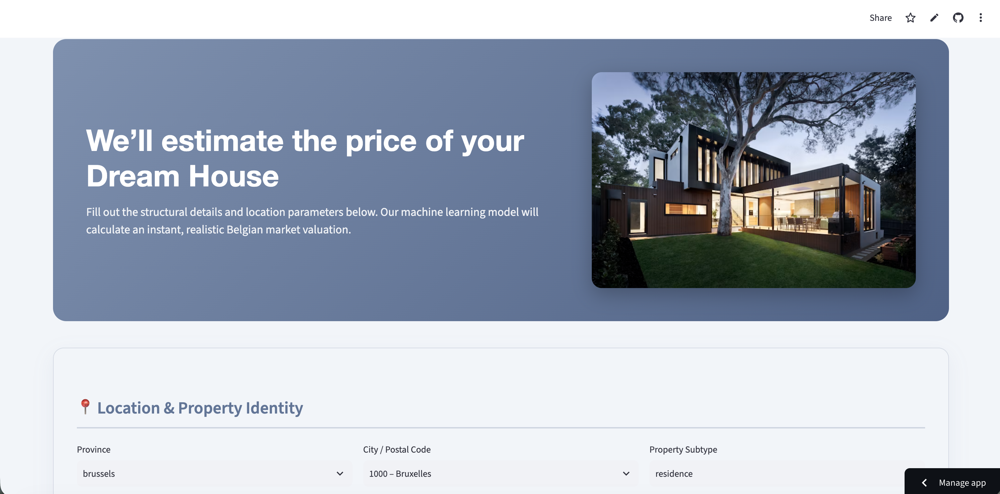

# 🏠 Immo Eliza — Deployment (API + Web App)


> A full-stack deployment of the Immo Eliza price-prediction model — a FastAPI backend serving XGBoost predictions, and a Streamlit web app for non-technical users, deployed independently on Render and Streamlit Community Cloud.

**🔗 Live App:** [immo-eliza-price-predictor-uzairsaeedkhan.streamlit.app](https://immo-eliza-price-predictor-uzairsaeedkhan.streamlit.app/)
**🔗 Price Predictor API :** [**🔗 Live App:** [https://immo-eliza-deployment-mxa7.onrender.com/docs](https://immo-eliza-deployment-mxa7.onrender.com/docs)

---

## 📋 Table of Contents
- [Project Overview](#-project-overview)
- [Architecture](#-architecture)
- [Project Structure](#-project-structure)
- [API](#-api)
- [Web Application](#-web-application)
- [Installation (Local Dev)](#-installation-local-dev)
- [Usage](#-usage)
- [Deployment](#-deployment)
- [Future Improvements](#-future-improvements)
- [Author](#-author)

---

## 📌 Project Overview

This project picks up where the [Immo Eliza ML pipeline](https://github.com/UzairSaeedKhan/immo-eliza-machine-learning) left off. With a trained XGBoost regression model in hand, the goal here is to make it **usable in the real world** — by exposing it through a REST API for developers, and a clean, interactive web app for non-technical users and clients to get instant Belgian property price estimates.

---

## 🏗️ Architecture


The API and frontend are **fully separate, independently deployable services** that communicate over HTTP:

- **API (backend)** — loads the model, handles preprocessing, returns predictions. Deployed on **Render** via Docker.
- **Web Application (frontend)** — collects user input, calls the API, displays results. Deployed on **Streamlit Community Cloud**.

Each service has its own `requirements.txt` and no shared cross-folder dependencies, keeping builds lightweight and deployments independent.

---

## 📁 Project Structure

```
immo-eliza-deployment/
├── api/
│   ├── data/
│   │   └── zipcode-belgium.json
│   ├── model/
│   │   └── xgboost_model.joblib
│   ├── utils/
│   │   ├── __init__.py
│   │   └── utils.py
│   ├── app.py
│   ├── predict.py
│   ├── schemas.py
│   ├── logger.py
│   ├── Dockerfile
│   └── requirements.txt
├── streamlit/
│   ├── data/
│   │   └── zipcode-belgium.json
│   ├── .streamlit/
│   │   └── config.toml
│   ├── app.py
│   ├── labels.py
│   ├── styles.py
│   └── requirements.txt
├── assets/
│   └── dashboard.png
├── .gitignore
└── README.md
```

---

## 🔌 API

Built with **FastAPI** + **Pydantic v2**.

**Routes:**
| Method | Route | Description |
|---|---|---|
| `GET` | `/` | Health check — returns `"alive"` |
| `POST` | `/predict` | Accepts property data, returns predicted price |

**Key features:**
- Enum-based validation for all categorical fields — invalid values are rejected before reaching the model
- Postal code → latitude/longitude resolution via a static Belgian postal code dataset, with a Brussels fallback default
- Reverse log-transform (`np.expm1`) applied to return real-world € prices, not log-scale values
- Model feature columns pulled directly from the fitted pipeline (`feature_names_in_`), so any extra user-facing fields (e.g. `city`, `description`) are automatically filtered out before prediction
- Structured error handling: `422` for invalid input, `500` for internal errors, with server-side logging for both
- Fully containerized with Docker for deployment on Render

Interactive API docs are auto-generated by FastAPI at `/docs` once the server is running.

---

## 🖥️ Web Application

Built with **Streamlit**.

- Interactive form with required-field indicators, grouped into logical sections (location, structure, quality/ratings, amenities)
- City/postal code selected via a single dropdown, resolved server-side into coordinates
- Custom-styled UI: hero banner, styled form, animated result card, and a "fun facts" panel shown while the prediction is loading
- Calls the deployed API over HTTP — never loads the model directly

### Dashboard Preview


---

## 🛠️ Installation (Local Dev)

**Backend:**
```bash
cd api
python -m venv venv
source venv/bin/activate  # Windows: venv\Scripts\activate
pip install -r requirements.txt
uvicorn app:app --reload --port 8000
```

**Frontend** (in a separate terminal):
```bash
cd streamlit
python -m venv venv
source venv/bin/activate  # Windows: venv\Scripts\activate
pip install -r requirements.txt
streamlit run app.py
```

Create a `streamlit/.env` file for local testing:
```
API_URL=http://localhost:8000
```

---

## 🚀 Usage

**Example request to `/predict`:**
```json
POST /predict
{
  "province": "antwerp",
  "type_property": "house",
  "subtype_property": "villa",
  "postal_code": 2000,
  "city": "Antwerpen",
  "livable_surface": 200.0,
  "bedrooms": 4.0,
  "bathrooms": 2,
  "toilets": 3,
  "facades": 4,
  "construction_year": 2010,
  "state_of_property": "excellent",
  "heating_type": "gas",
  "sun_exposure": "south",
  "epc_score": "b",
  "flooding_area_type": "no_flooding_area",
  "terrace": 1,
  "garden": 1,
  "garage": 1,
  "swimming_pool": 0
}
```

**Example response:**
```json
{
  "prediction": 412500.75,
  "status_code": 200
}
```

---

## ☁️ Deployment

| Service | Platform | Notes |
|---|---|---|
| API (backend) | [Render](https://render.com/) | Deployed via Docker, `api/Dockerfile` |
| Web App (frontend) | [Streamlit Community Cloud](https://streamlit.io/cloud) | Points to `streamlit/app.py`; `API_URL` set via Streamlit Secrets |

---

## 🔮 Future Improvements

- Frontend authentication, plus autofill of related fields (e.g. auto-suggesting `province` from selected `postal_code`)
- Multi-page Streamlit flow (landing page, buy/sell selection, then the prediction form)
- More precise geolocation (exact address-level lat/long instead of city-level approximation)
- Caching frequent predictions to reduce redundant API calls
- API authentication if opened up to external developers

---

## 👤 Author

**Uzair Saeed Khan**
BeCode AI & Data Science Bootcamp
[GitHub](https://github.com/UzairSaeedKhan) · [LinkedIn](https://linkedin.com/in/uzairsaeedkhan)